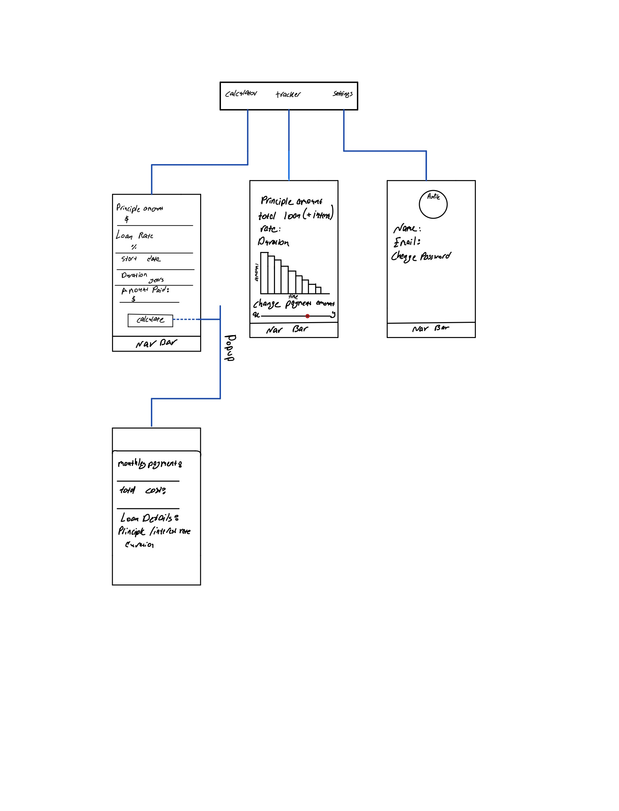

Original App Design Project - README Template
===

# Student Loan Calculator

## Table of Contents
1. [Overview](#Overview)
1. [Product Spec](#Product-Spec)
1. [Wireframes](#Wireframes)
2. [Schema](#Schema)

## Overview
### Description
Basic Student loan Calculation app that helps keep track and manage payments.

### App Evaluation
[Evaluation of your app across the following attributes]
- **Category:** Finance
- **Mobile:** This app is intended for iOS.
- **Story:** Takes loan information and based on that provides monthly payments and loan tracking.
- **Market:** All students who need help manging there student loans.
- **Habit:** This app can be used whenever the user needs to view info on loan.
- **Scope:** Based on loan info we will provide them with ideal loan payment based on time constraint and compare loan progress based on current payment.

## Product Spec

### 1. User Stories (Required and Optional)

**Required Must-have Stories**

* Login
* Sign up
* Tracking screen
* Calculation screen
* results(Segue from Calculation screen)
* Settings

**Optional Nice-to-have Stories**

* Generalizing app to accomodate for loans other than student loans.

### 2. Screen Archetypes

* Login
* Signup
   * Email
   * Name
   * Password
* Calculating Screen
   * Principal Amount
   * loan rate
   * start date
   * duration
   * Amount paid
* Tracking Screen
   * Progress Graph
   * Total Left
   * adjustable monthly payment
* Setting
   * Name
   * Email
   * change password
   * Profile Picture
* Result 
   * Monthly Payment 
   * Total cost 
   * Loan details

### 3. Navigation

**Tab Navigation** (Tab to Screen)

* Login
* Sign up
* Tracking screen
* Calculation screen
  * results(Segue from Calculation screen)
* Settings

**Flow Navigation** (Screen to Screen)

* Signup -> Creates account if user doesnot have one.
  * User is sent to calculation screen
* Setting
  * The User can change profile picture
  * The User can change password
* Login
  * User is sent to Tracking screen
* Tracking Screen
  * User can view loan progress
  * Change monthly payment to see affect on progress

## Wireframes
[Add picture of your hand sketched wireframes in this section]


### [BONUS] Digital Wireframes & Mockups

### [BONUS] Interactive Prototype


## Schema 
[This section will be completed in Unit 9]
### Models
#### Users

   | Property      | Type     | Description |
   | ------------- | -------- | ------------|
   | UserId      | Number   | Uniquely identify a user |
   | UserName	        | string| Name of the user |
   | Password         | string     | password for the account |
   | Email     | String   | Email for the account |
   | Profile_pic | File   | Image/ poster of that user |
   | Loan_Id   | Number   | to connect with loan table |
   
   
#### Loans

   | Property	| Type	| Description |
   |------------| ----- | ----------- |
   | LoanId	    | Number |	Primary key to uniquely identify a particular record |
   |P.amount	|Number	| Principal amount of the Loan|
   | Interest_rate | Number     | Interest rate of the Loan |
   |Years   |Number	| Years duration for the loan|
   | Paid_amount     |Number   | Amount already paid so far |
 
### Networking
- [Add list of network requests by screen ]
- [Create basic snippets for each Parse network request]

   - Tracker Screen
      - (Read/GET) Get the current loan info
      ```
      let query = PFQuery(className:"Loans")
      query.whereKey("LoanId", equalTo: loanId)
      query.findObjectsInBackground { (user: [PFObject]?, error: Error?) in
     if let error = error { 
        print(error.localizedDescription)
     } else {
        print("Successfully retrieved \(loan) information")
      // TODO: Do something with loan...
       }
        }
        ```
    
   - Profile Screen
      - (Read/GET) Get the user info
      ```
      let query = PFQuery(className:"Users")
        query.whereKey("UserId", equalTo: userId)
        query.findObjectsInBackground { (movies: [PFObject]?, error: Error?) in
       if let error = error { 
      print(error.localizedDescription)
       } else {
      print("Successfully retrieved \(user) information")
        // TODO: Do something with the user...
       }
        }

      ```
- [OPTIONAL: List endpoints if using existing API such as Yelp]

#### Progress gifs for Sprint 1


