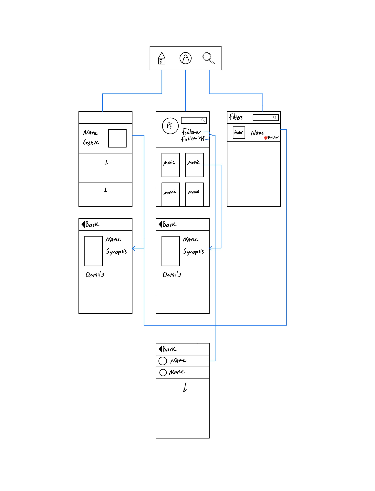

Original App Design Project - README Template
===

# Instamovie 

## Table of Contents
1. [Overview](#Overview)
1. [Product Spec](#Product-Spec)
1. [Wireframes](#Wireframes)
2. [Schema](#Schema)

## Overview
### Description
Instamovie is an app that let's you connect with other movie lovers an it recommends you movies based on connections and preferences.

### App Evaluation
[Evaluation of your app across the following attributes]
- **Category:** Entertainment/Social Networking
- **Mobile:** This app is intended for iOS. 
- **Story:** Takes the users movie prefrences to suggest new movies and connects like-minded users.
- **Market:** Any movie lovers with access to internet and iOS device.
- **Habit:** This app can be used periodically based on how often a user watched movies.
- **Scope:** Based on the survey taken from the user, we will provide them with a collection of movies personalized to their preferences. Our users will also have the chance to connect with other users based on shared interests.
 
## Product Spec

### 1. User Stories (Required and Optional)

**Required Must-have Stories**

* Login
* Sign up
    * Survey Tab 
* Home Tab
* Discover Tab
* Profile tab  

### 2. Screen Archetypes
* Login
* Signup
   * Username
   * Name 
   * Email
   * Password
   * Survey
* Home Tab
   * Shows movies based on popularity between followers and use preferences. 
* Profile Tab
   * Profile picture
   * Follower Count
   * Following Count
   * Collection of movies favorited
* Discover Tab 
   * Search bar
   * Filters
   * Populates with search results
   
### 3. Navigation

**Tab Navigation** (Tab to Screen)

* Login
* Sign up
    * Survey Tab 
* Home Tab
* Discover Tab
* Profile tab 

**Flow Navigation** (Screen to Screen)

* Signup -> Creates account if user doesnot have one. 
   * The user is asked a survey upon sign up.

* Profile
   * The User can change profile picture
   * Can go through the follower and following list
   * Can tap on a Movie to expand details.
* Discover 
   * Can tap on a Movie to expand details.
   * User is able to comment and favorite movies.

## Wireframes
[Add picture of your hand sketched wireframes in this section]


### [BONUS] Digital Wireframes & Mockups

### [BONUS] Interactive Prototype

## Schema 

### Models
#### Users

   | Property	| Type	| Description |
   |------------| ----- | ----------- |
   | UserId	    | Number |	Primary key to uniquely identify a particular record |
   |Name	|String	| Holding the name of the user|
   |Profile_pic	|File	|Profile Picture of the user|
|following count| 	Number	|Numbers of people user is following|
|followercount|	Number	|Numbers of people following the user|
|userpreferences|	Array|	List of genres user liked following the survey|
|moviesfavorited|	Array|	List of movieids|


#### Movie

   | Property      | Type     | Description |
   | ------------- | -------- | ------------|
   | MovieId      | Number   | Uniquely identify a movie |
   | Name	        | string| Name of the movie |
   | Popularity         | Number     | Metrics to filter |
   | Description      | String   | Basic information about the movie |
   | Movie_img | Number   | Image/ poster of that particular movie |
   | Numberoflikes    | Number   | Count of number of likes by users for that movie |
   | Numberofcomments     | Number | Count of number of comments by users for that movie |
   | CommentId     | String | This will be foreign key referencing to comment table 
   | Genre     | String | Genre of the movie 

#### Comments

|Property	|Type|	Description|
| --------- |----| ------------|
|CommentId|	Number	|Uniquely identifies a comment -PK and refers back to movie|
|UserId	|Number	|Refers back to the user
|Description	|String|	It consists comments made by user|

### Networking
    
  - Home Screen
      - (Read/GET) Get all the movies based on user preferences
      ```
         let query = PFQuery(className:"MovieData")
      query.whereKey("Genre", equalTo: userPreferences)
      query.findObjectsInBackground { (movies: [PFObject]?, error: Error?) in
       if let error = error { 
          print(error.localizedDescription)
       } else {
          print("Successfully retrieved \(movies.count) movies.")
      // TODO: Do something with movies...
       }
            }
         ```
   - Profile Screen
      - (Read/GET) Get the current user info
      ```
      let query = PFQuery(className:"UserData")
      query.whereKey("name", equalTo: userName)
      query.findObjectsInBackground { (user: [PFObject]?, error: Error?) in
     if let error = error { 
        print(error.localizedDescription)
     } else {
        print("Successfully retrieved \(user) information")
      // TODO: Do something with user...
       }
        }
        ```
    
   - Discover Screen
      - (Read/GET) Get movie based on search criteria specified
      ```
      let query = PFQuery(className:"MovieData")
        query.whereKey("Genre", equalTo: userPreferences)
        query.findObjectsInBackground { (movies: [PFObject]?, error: Error?) in
       if let error = error { 
      print(error.localizedDescription)
       } else {
      print("Successfully retrieved \(movies.count) movies.")
        // TODO: Do filtering on the movies based on the search criteria. 
       }
        }

      ```
    
### [OPTIONAL: List endpoints if using existing API such as Yelp]
#### Using: MovieDB API: https://www.themoviedb.org/?language=en-US
   |HTTP Verb | Endpoint | Description|
   ----------|----------|------------|
   | `GET`    | /id | get the specific movie id|
   | `GET`    | /name | get the movie name|
   | `GET`    | /poster_path   | get the path of the poster|
   | `GET`    | /parts.genre_ids| returns the movies genre|
   |`GET`    | /overview| returns an overview of the movie|
